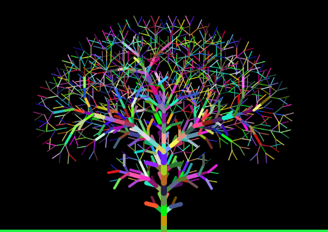

# L-System
Exploring L-Systems and their Visualizations

This repo houses code that I used to explore L-Systems!

Currently, this repo houses the code that makes it possible to visualize some basic Trees made via L-Systems! For more information on L-Systems you can check out my [post](https://keivan.tech/posts/lsystem/random_lsystem/).

If this is configured properly, you should be able to view the demo [here](https://keivan.tech/L-System/) in your browser itself! (Still a bit buggy for Mobile devices)

__Note:__ If that does not work, try cloning the repo and opening the [index.html](index.html) page in your browser.

## How to use?

You can use this to create your artificial trees by defining your own rules!

For example:

This was created by using this tool!

Letters in the Alphabet and their definitions :

```txt
F = draws a line from the current orientation of the desired length
[ = remembers your current orientation
] = goes back to saved orientation
+ = changes angle by desired value in the clockwise direction
- = changes angle by desired value in the anti-clockwise direction
```

Changes made to the `Rules`, `Length`, `Angle` lead to automatic redraw of the tree. You can also customize other things like branch widths, colors if you want, you may need to use the `ReGen` button in that case.

Try out some of the `Possible Rules` to get started and understand the system. You can iterate through the various generations using the arrows. Do note that if you try to generate large trees the system might lag and the tab may crash as well.

Hopefully, you will enjoy this visualization!

## Acknowledgements

- [Code for Tree Generation](https://github.com/TanviKumar/treegen) My code is highly based on this code. I have tried to improve upon the visualization and make it more accessible
- [Materialize.css](https://github.com/Dogfalo/materialize)
- [p5.js](https://github.com/processing/p5.js)